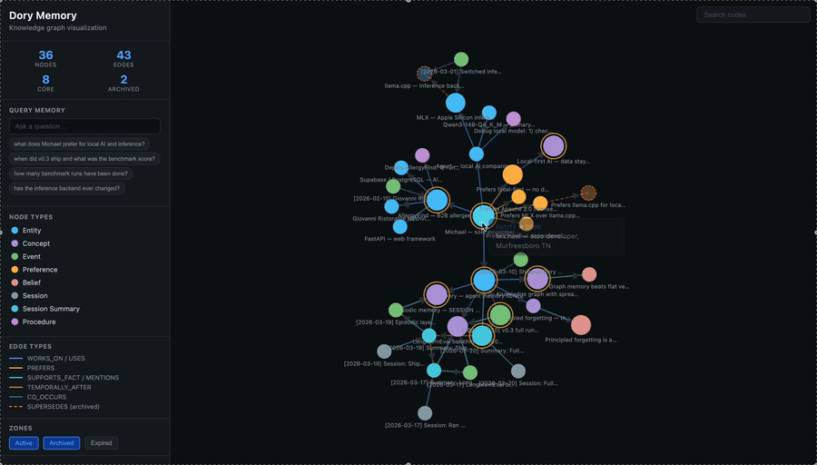

# Dory

**+13pp on LongMemEval. The best Python-native, local-first agent memory library.**

```bash
pip install dory-memory
```

```python
from dory import DoryMemory

mem = DoryMemory()
mem.observe("User prefers local-first AI")
mem.observe("User switched from llama.cpp to MLX — 25% faster")

print(mem.query("what does the user prefer for inference?"))
# → MLX (updated preference, supersedes llama.cpp)
```

Dory gives your agent persistent, structured memory across sessions — with spreading activation retrieval, principled forgetting, and an episodic layer that scored **79.8% on LongMemEval** (beats Mem0 68.4% and Zep 71.2%). Zero server. Single SQLite file. Works offline.

---

## The problem

Every time you start a new session, your agent starts from zero. Even systems that claim to "remember" you are doing keyword search through a flat list of notes. That's not memory — that's ctrl+F.

The deeper problem: naive memory injection makes things *worse*. Dumping everything into context creates noise that degrades model performance. Research ([Chroma, 2025](https://research.trychroma.com/context-rot)) shows all major frontier models degrade starting at 500–750 tokens of context.

## What Dory does differently

**Four memory types, all in one place**

| Type | What it stores | Status |
|---|---|---|
| Episodic | Past events, sessions, experiences | ✓ |
| Semantic | Facts, preferences, entities, relationships | ✓ |
| Procedural | Skills, workflows, repeatable processes | ✓ |
| Working | In-context window (managed by your LLM) | — |

**Spreading activation retrieval** — not vector similarity search. Relevant memories pull in connected memories through the graph. "AllergyFind" activates "Giovanni's" activates "FastAPI" activates "menu endpoint" because those things co-occurred. That's how human memory works.

**Cacheable prefix output** — instead of regenerating your full memory context every turn (which blows prompt caching), Dory splits output into a *stable prefix* (same until memory actually changes) and a *dynamic suffix* (query-specific). Result: cache hits every turn. 4–10x cheaper to run agents with memory than without.

**Principled forgetting** — three decay zones: active, archived, expired. Scores based on recency + frequency + relevance. Nothing is ever deleted — archived memories are queryable for historical context. No other production memory library ships this.

**Bi-temporal conflict resolution** — when a fact changes, the old version is archived with a `SUPERSEDES` edge and a timestamp. You can query "what was true in January" and get the right answer.

**Zero-server stack** — everything runs in a single SQLite file. `sqlite-vec` for vectors, FTS5 for keyword search, adjacency tables for the graph. No Postgres, no Neo4j, no Redis. Works offline.

---

## Quick start

```python
from dory import DoryMemory

# No dependencies required — works out of the box
mem = DoryMemory()

# Add memories manually
mem.observe("Alice is migrating payments from Stripe to a custom processor", node_type="EVENT")
mem.observe("Alice prefers async Python over synchronous frameworks", node_type="PREFERENCE")
mem.observe("The migration deadline is end of Q2", node_type="EVENT")

# Query — returns context to inject into your LLM prompt
context = mem.query("payment migration deadline")
print(context)

# End of session: consolidate, decay, promote core memories
mem.flush()

# See your graph in the browser
mem.visualize()
```

Or from the command line after any session:

```bash
dory visualize          # opens graph in browser
dory show               # print stats + core memories
dory query "topic"      # spreading activation from the terminal
```

**With auto-extraction** (add a model and Dory extracts memories from conversation turns automatically):

```python
mem = DoryMemory(extract_model="qwen3:14b")                 # local via Ollama
mem = DoryMemory(                                           # Claude
    extract_model="claude-haiku-4-5-20251001",
    extract_backend="anthropic",
    extract_api_key="sk-ant-...",
)
mem = DoryMemory(                                           # GPT / Grok / any compat
    extract_model="gpt-4o-mini",
    extract_backend="openai",
    extract_api_key="sk-...",
)

# Log turns — extraction happens automatically every N turns
mem.add_turn("user", "I'm working on AllergyFind today, need to add a menu endpoint")
mem.add_turn("assistant", "What authentication approach are you using?")

# Build API-ready messages with prompt caching
result = mem.build_context("menu endpoint authentication")
messages = result.as_anthropic_messages(user_query)   # Anthropic SDK w/ cache_control
messages = result.as_openai_messages(user_query)      # OpenAI / compat
```

### MCP server (Claude Code / Claude Desktop)

```bash
pip install 'dory-memory[mcp]'

# Register globally across all Claude Code projects
claude mcp add --scope user dory -- dory-mcp

# Or with a specific DB path
claude mcp add --scope user dory -- dory-mcp --db /path/to/engram.db
```

Five tools are exposed: `dory_query`, `dory_observe`, `dory_consolidate`, `dory_visualize`, `dory_stats`.

---

## Interactive demo

**[Live graph visualization →](https://michaelwmartinii.github.io/Dory/demo.html)**



Force-directed knowledge graph with spreading activation query mode, edge type coloring, archived/superseded nodes, and session summary chain. Click any of the pre-set queries to see retrieval in action.

---

### Framework adapters

**LangChain** — drop-in `BaseMemory` replacement:

```python
from dory.adapters.langchain import DoryMemoryAdapter
from langchain.chains import ConversationChain
from langchain_anthropic import ChatAnthropic

memory = DoryMemoryAdapter(
    extract_model="claude-haiku-4-5-20251001",
    extract_backend="anthropic",
    extract_api_key="sk-ant-...",
)
chain = ConversationChain(llm=ChatAnthropic(model="claude-sonnet-4-6"), memory=memory)
```

**LangGraph** — graph nodes with the `(state) -> state` signature:

```python
from dory.adapters.langgraph import DoryMemoryNode, MemoryState
from langgraph.graph import StateGraph, START, END

mem = DoryMemoryNode(extract_model="claude-haiku-4-5-20251001", extract_backend="anthropic")

builder = StateGraph(MemoryState)
builder.add_node("load_memory", mem.load_context)   # or mem.aload_context for async
builder.add_node("record_turn", mem.record_turn)
builder.add_edge(START, "load_memory")
builder.add_edge("load_memory", "record_turn")
builder.add_edge("record_turn", END)
graph = builder.compile()
```

**Multi-agent** — shared memory pool with thread-safe writes and agent attribution:

```python
from dory.adapters.multi_agent import SharedMemoryPool

pool = SharedMemoryPool(db_path="shared.db")
pool.observe("User prefers dark mode", agent_id="agent-1")
pool.add_turn("user", "Let's ship it", agent_id="agent-2", session_id="s1")
results = pool.query("UI preferences")
agent_nodes = pool.get_agent_nodes("agent-1")
```

### Async API

All `DoryMemory` methods have async counterparts — safe to await from FastAPI, LangGraph, and any async framework:

```python
context = await mem.aquery("current topic")
result  = await mem.abuild_context("current topic")
await mem.aadd_turn("user", "message")
node_id = await mem.aobserve("User prefers JWT", node_type="PREFERENCE")
stats   = await mem.aflush()
```

### Export / import

```python
from dory.export.jsonld import JSONLDExporter

exporter = JSONLDExporter(graph)
exporter.export("memory.jsonld.json")           # write to file
data = exporter.export()                         # or get dict

JSONLDExporter.import_into(graph, "memory.jsonld.json")   # round-trip import
```

### Advanced: direct pipeline access

```python
from dory import Graph, Observer, Prefixer

graph = Graph("myapp.db")
obs = Observer(graph, backend="ollama", model="qwen3:14b")
p = Prefixer(graph)
# ... same as DoryMemory but with full control
```

---

## How it works

### Knowledge graph

Every piece of information is a node. Nodes have types: `ENTITY`, `CONCEPT`, `EVENT`, `PREFERENCE`, `BELIEF`, `PROCEDURE`, `SESSION` (episodic narrative), `SESSION_SUMMARY` (structured episodic with `salient_counts`). Edges between them are typed and weighted: `USES`, `WORKS_ON`, `PREFERS`, `SUPERSEDES`, `CO_OCCURS`, `SUPPORTS_FACT`, `TEMPORALLY_AFTER`, etc.

Salience is computed, not assigned:
```
salience = α × connectivity + β × activation_frequency + γ × recency
```

High-salience nodes become **core memories** — they anchor the stable context prefix.

### Observer

Every N conversation turns (configurable), the Observer calls a local LLM to extract structured memories from the raw conversation. Extractions have confidence scores — anything below the threshold is logged but not written to the graph, guarding against false memory.

Backends: Ollama (default), Anthropic (Claude), or any OpenAI-compatible endpoint (llama.cpp, Clanker, vLLM, GPT, Grok, etc.).

### Prefixer

Builds context in two parts:

```
[stable prefix]         ← core memories + key relationships
                          same bytes across turns → prompt cache hits

[dynamic suffix]        ← spreading activation for this specific query
                          + recent episodic observations
                          changes per query but small
```

### Decayer

Runs periodically to score every node:
```
score = recency_weight  × exp(-λ × days_since_activation)
      + frequency_weight × log(1 + activation_count)
      + relevance_weight × salience
```

Nodes below the active floor → archived. Below the archive floor → expired. Core memories are shielded with a configurable multiplier.

### Reflector

Finds near-duplicate nodes (Jaccard similarity ≥ 0.82, empirically tuned), merges them keeping the higher-salience one. Detects supersession — same subject, newer fact, Jaccard in [0.45, 0.82) — archives the old node, and adds a `SUPERSEDES` provenance edge. Old observations are compressed into summaries. Dedup thresholds are practical defaults chosen conservatively; sensitivity analysis is planned.

---

## Architecture

```
dory/
├── graph.py          ← nodes, edges, salience computation
├── schema.py         ← NodeType, EdgeType, zone constants
├── activation.py     ← spreading activation engine
├── consolidation.py  ← edge decay, strengthen, prune, promote/demote core
├── session.py        ← session-level helpers: query, observe, write_turn, end_session
├── memory.py         ← DoryMemory — the high-level drop-in API (sync + async)
├── visualize.py      ← D3.js interactive graph visualization
├── mcp_server.py     ← MCP tools (dory_query, dory_observe, dory_consolidate, …)
├── store.py          ← SQLite backend (nodes, edges, FTS5, observations)
│
├── pipeline/
│   ├── observer.py   ← LLM extraction of memories from conversation turns
│   ├── summarizer.py ← episodic layer: SESSION nodes from conversation turns
│   ├── prefixer.py   ← stable prefix + dynamic suffix builder
│   ├── decayer.py    ← node decay scoring + zone management
│   └── reflector.py  ← dedup, supersession, observation compression
│
├── adapters/
│   ├── langchain.py   ← DoryMemoryAdapter — LangChain BaseMemory drop-in
│   ├── langgraph.py   ← DoryMemoryNode — LangGraph StateGraph nodes
│   └── multi_agent.py ← SharedMemoryPool — thread-safe multi-agent memory
│
└── export/
    └── jsonld.py      ← JSONLDExporter — portable JSON-LD round-trip
```

---

## Local LLM setup

Dory defaults to Ollama for LLM-based extraction (Observer) and embedding (vector search).

```bash
# Pull the default models
ollama pull qwen3:14b          # extraction
ollama pull nomic-embed-text   # embeddings (768-dim, offline after pull)
```

OpenAI-compatible endpoint (Clanker, llama.cpp server, vLLM):
```python
obs = Observer(
    graph,
    backend="openai",
    base_url="http://localhost:8000",
    model="qwen3",
)
```

Vector search activates automatically once `nomic-embed-text` is available. Falls back to FTS5 BM25 + substring search if no embedding model is running.

---

## Decay zones

| Zone | Behavior | How to query |
|---|---|---|
| `active` | Retrieved in all normal queries | `graph.all_nodes()` (default) |
| `archived` | Invisible to normal queries | `graph.all_nodes(zone="archived")` |
| `expired` | Completely invisible | `graph.all_nodes(zone=None)` |

User-meaningful memory is never deleted by forgetting — archived and expired nodes retain full provenance and can be restored if reactivated. The one exception: exact structural duplicates detected by the Reflector are hard-merged (the lower-salience copy is removed, all its edges are rewired to the winner).

---

## What's different from other memory libraries

| | mem0 | Zep | Letta | Mastra | **Dory** |
|---|---|---|---|---|---|
| Principled forgetting | ✗ | ✗ | ✗ | ✗ | ✓ |
| Spreading activation retrieval | ✗ | ✗ | ✗ | ✗ | ✓ |
| Cacheable prefix output | ✗ | ✗ | ✗ | ✓ (TS only) | ✓ |
| Bi-temporal conflict resolution | ✗ | ✓ | ✗ | ✗ | ✓ |
| Zero-server local stack | partial | ✗ | partial | ✗ | ✓ |
| Drop-in Python library | ✓ | partial | ✗ | ✗ | ✓ |
| Apache 2.0 | ✓ | ✓ | ✓ | ✓ | ✓ |

---

## Roadmap

**Shipped (v0.1)**
- [x] MCP server — expose Dory memory as MCP tools for Claude Code / Claude Desktop
- [x] LangChain adapter — `dory.adapters.langchain.DoryMemoryAdapter` implements `BaseMemory`
- [x] LangGraph adapter — `dory.adapters.langgraph.DoryMemoryNode` for StateGraph integration
- [x] Procedural memory — `PROCEDURE` node type for skills, workflows, and repeatable processes
- [x] Multi-agent shared memory — `dory.adapters.multi_agent.SharedMemoryPool` with thread-safe writes and agent attribution
- [x] Portable import/export format — `dory.export.jsonld.JSONLDExporter` for JSON-LD round-trips

**Shipped (v0.2)**
- [x] Episodic layer — `SESSION_SUMMARY` nodes with structured `salient_counts` metadata
- [x] Retrieval fusion — three-mode routing (graph / episodic / hybrid) via deterministic regex, no extra LLM calls
- [x] Staged retrieval — spreading activation → SUPPORTS_FACT traversal → SESSION_SUMMARY injection
- [x] Behavioral preference synthesis — `Reflector` detects repeated behavioral patterns across sessions and synthesizes PREFERENCE nodes without LLM calls

**Shipped (v0.3)**
- [x] Full 500-question LongMemEval run — 79.8% Sonnet/Sonnet (+13.0pp over v0.1)
- [x] Temporal arithmetic prompt — step-by-step date math before answering
- [x] Count cross-validation — `salient_counts` verified against EVENT nodes, low-confidence flagged
- [x] Behavioral preference synthesis — `Reflector` synthesizes PREFERENCE nodes from repeated patterns

**In progress (v0.4)**
- [ ] Preference inference — targeted improvement on single-session-preference (currently 46.7%)
- [ ] Graph topology demo — `demo_topology.py` showing provenance / evolution queries flat systems can't answer
- [ ] S-split benchmark — longer sessions (~115K tokens), better test of spreading activation value
- [ ] Production hardening — concurrent write safety, adversarial memory injection defense

---

## Research basis

Dory draws from:
- [MemGPT: Towards LLMs as Operating Systems](https://arxiv.org/abs/2310.08560) — two-tier memory architecture
- [Zep: A Temporal Knowledge Graph Architecture](https://arxiv.org/abs/2501.13956) — bi-temporal provenance
- [MAGMA: Multi-Graph based Agentic Memory](https://arxiv.org/abs/2601.03236) — multi-graph retrieval
- [Mastra Observational Memory](https://mastra.ai/research/observational-memory) — cacheable prefix architecture (Python port)
- [LongMemEval](https://arxiv.org/abs/2410.10813) (ICLR 2025) — the benchmark we care about. Published scores: Mem0 68.4%, Zep 71.2%, Mastra 94.87%¹.

  | Version | Extract | Answer | Questions | Score | Notes |
  |---|---|---|---|---|---|
  | v0.1 | Haiku | Haiku | 500 (full) | 54.4% | Baseline |
  | v0.1 | Sonnet | Sonnet | 500 (full) | 66.8% | |
  | v0.3 | Haiku | Haiku | 40 (spot check) | 67.5% | Episodic hybrid, spot check |
  | **v0.3** | **Sonnet** | **Sonnet** | **500 (full)** | **79.8%** | **Episodic hybrid, full run** |

  Category breakdown (v0.3 Sonnet, 500q):

  | Category | v0.1 Sonnet | v0.3 Sonnet | Δ |
  |---|---|---|---|
  | temporal-reasoning | 46.6% | 75.9% | +29.3pp |
  | knowledge-update | 75.6% | 84.6% | +9.0pp |
  | multi-session | 70.7% | 80.5% | +9.8pp |
  | single-session-assistant | 82.1% | 87.5% | +5.4pp |
  | single-session-user | 85.7% | 88.6% | +2.9pp |
  | single-session-preference | 43.3% | 46.7% | +3.3pp |
  | **Overall** | **66.8%** | **79.8%** | **+13.0pp** |

  ¹ Mastra uses GPT-4o-mini (TypeScript). Dory uses Claude on Python. Architecturally
  different stacks — not directly comparable. See [ablation study](benchmarks/ABLATION.md)
  for component attribution.

  **Disclaimer:** LongMemEval oracle split uses pre-filtered context (~15K tokens per question).
  Production performance with live, noisy, unfiltered conversations will differ.
- Collins & Loftus (1975) — spreading activation in semantic memory
- Hebb (1949) — neurons that fire together wire together
- [Hopfield (1982) — Neural networks and physical systems with emergent collective computational abilities](https://www.pnas.org/doi/10.1073/pnas.79.8.2554) — statistical mechanics of associative memory; energy landscape formulation underlying spreading activation (Nobel Prize in Physics, 2024)

---

## License

Apache 2.0 — see [LICENSE](LICENSE).

---

*Named after Dory from Finding Nemo, because your AI agent right now is Dory. This fixes it.*
